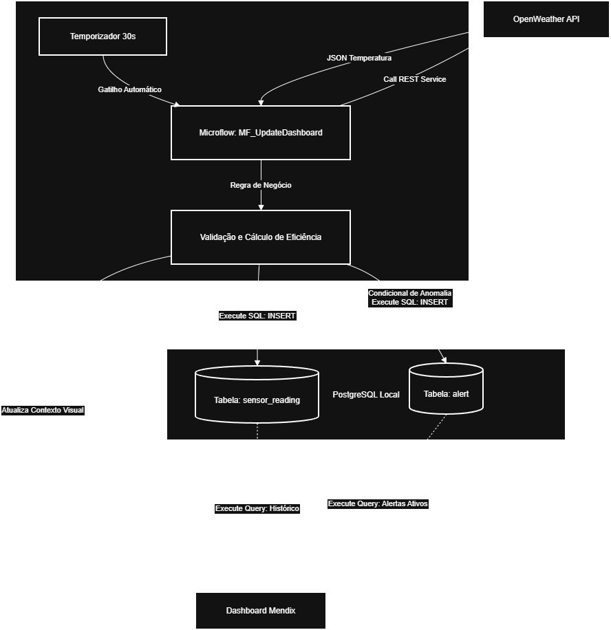

# Arquitetura e Engenharia do Sistema

## A. Estrutura de Dados
O modelo de persistência no PostgreSQL foi desenhado para garantir integridade transacional. Foram criadas duas tabelas principais (`sensor_reading` e `alert`). A escolha de chaves primárias do tipo `SERIAL` e carimbos de tempo via `DEFAULT NOW()` garante total rastreabilidade cronológica na base, isolando a responsabilidade de timestamping do Mendix e transferindo-a para o motor do banco.

## B. Camada de Processamento
A validação e cálculo de eficiência (variando de 23% a 100% conforme os limares de 21°C e 32°C) ocorrem em memória, no microflow, utilizando expressões lógicas de interpolação linear. O fluxo garante que a escrita no banco só seja executada caso o dado passe por todas as restrições (ex: temperatura coerente com o ambiente), evitando a poluição do banco externo com leituras corrompidas.

## C. Design de Integração API
A chamada para a OpenWeather (atualmente configurada para Belo Horizonte) utiliza templates de parâmetros com `urlEncode` para blindar injeções de string. Para evitar sobrecargas e bloqueios por *Rate Limit* na API gratuita, o temporizador da aplicação realiza invocações pontuais a cada 30 segundos, mitigando picos de rede e garantindo estabilidade no endpoint de origem. Erros de rede (timeouts ou 401) são capturados via *Error Handling*, disparando alertas de sistema sem paralisar a renderização do dashboard.

## D. Estratégia de Alertas
As anomalias são interceptadas em tempo real durante o ciclo do microflow. Quatro eventos principais engatilham a gravação independente na tabela `alert`:

1. **Eficiência Crítica:** Operação abaixo de 30% (limiar crítico de negócio).
2. **Variação Anômala:** Queda súbita maior que 20 pontos percentuais em relação à leitura imediatamente anterior.
3. **Leitura Suspeita:** Excesso ou déficit térmico fora do range aceitável do equipamento (-10°C a 50°C).
4. **Falha de Comunicação:** Indisponibilidade da API da OpenWeather (Timeout/HTTP Error), associada ao registro de `status` não-operacional na leitura principal.

## E. Performance e Escalabilidade (O Gargalo de 100 Máquinas)
Com 100 sensores publicando simultaneamente, o gargalo primário não reside no banco de dados (o PostgreSQL absorve inserts nessa magnitude perfeitamente). O estrangulamento ocorreria nas requisições HTTP para a API OpenWeather, estourando a cota gratuita. Em uma infraestrutura de produção escalável, os dados seriam transmitidos por sensores físicos via protocolos de telemetria leve (como MQTT) diretamente para um broker na planta industrial, eliminando a latência de chamadas HTTP externas e garantindo processamento analítico em tempo real.

---
### Fluxo de Dados e Integração

